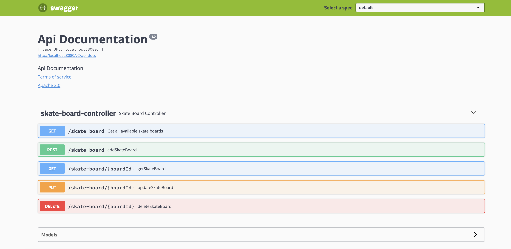

### Skateboard REST API

In the shared mobility space, there are a number of different types of shared assets - cars, scooters, ebikes. For this project, we want to create a starting point for an API that will allow individual skateboarders to share their boards. 

The goal of this project is to assess development skills suitable for a backend developer position by testing knowledge and proficiency with software design, unit testing and web technologies like HTTP and REST.

- **Project Name:** Skateboard REST API
- **Project Goal:** Create/define an API that will help skateboarders to share their 'boards'
- **Technology:** Pick any language, framework and testing framework you like
- **Deliverables:**  Fork the project into your own account. Submit a pull request on https://github.com/mbsoft/new_mob_assignments that includes your complete solution

**Description: (Note: these stories are intentionally somewhat vague)**

As a skateboard owner I want to be able to add my individual board to a skateboard sharing marketplace.

As a skateboard owner I want to be able to indicate that my board is available or unavailable for sharing

As a skateboard owner I want to be able to modify the details for the board that I share.

As a skateboard borrower, I want to see a list of available boards

**Task:** Build the REST API that might support the stories described above. Write unit tests for each component.

**Requirements:**

1. Design your API in a RESTful way and respond with JSON.
1. Make sure your code has tests.
1. Consider some form of logging
1. Write the code and design your system to be as realistic and production-ready as possible. Follow best-practices and focus on quality.
1. A skateboard might have the following attributes: name of owner, brand, weight, length, location, timestamp and any other attribution you deem necessary
1. Add endpoints that support your solution 
1. Bonus points for adding any kind of front-end that can be used to visualize available boards through use of the designed APIs
some examples:
 
  * **Create skateboard:**

    - attributes for a board might include the photo, dimensions, specs etc.
    - To keep things simple, no authentication needs to be performed. 

  * **Get skateboards**
    - perhaps based on status, spec filter etc.
    
  * **Update skateboard**
    - change status, add additional details/specs etc.
  
  * **Delete skateboard**
  
  

**Submission Details:**

Project contains Spring boot APP serving APIs acting on resource skate boards.

    APIs:
        GET /skate-board
            Return all skate boards
        PUT /skate-board
            Return skate board details based on ID
        GET /skate-board/:id
            Return selected skate board based on ID
        PUT /skate-board/:id
            Update the selected skate board based on ID
        DELETE /skate-board/:id
            Delete the selected skate board based on ID
            
REACT APP displaying dash board with all the features available on APIs

1. Run ./gradlew clean build
2. java -jar build/libs/demo-0.0.1-SNAPSHOT.jar
3. Swagger url: http:localhost:8080/swagger-ui.html, Swagger Doc Json: http://localhost:8080/v2/api-docs
3. cd skateboard-app
4. yarn start

